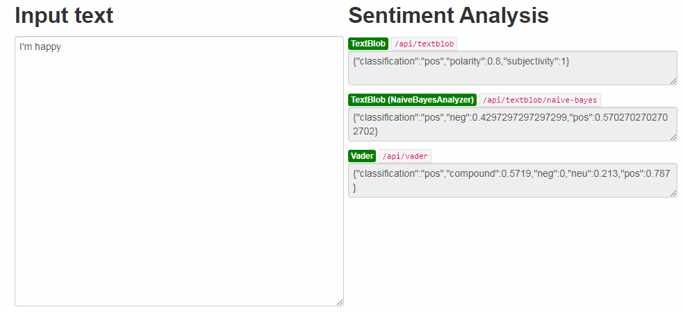

# py-sentiment-api-server
Sentiment Analysis API server based on TextBlob and NLTK Vader components ( Docker container provided )

## Description

This component provide an web API provided sentiment analysis based on several well known components :

- TextBlob
- TextBlob with Naive Bayses analyser
- NLTK Vader component

For each component, and server endpoint is implemented :
- /api/textblob
- /api/textblob/naive-bayes
- /api/vader

## Open-source license

  Apache License Version 2.0

## Install

The server is implemented on Python using Flask, NLTK and TextBlob components.

### With docker

- build the container

```
  docker build -t py-sentiment-api-server .
```

- run the server

```
  docker run -p 5000:8000 -d py-sentiment-api-server
```

### On Windows

```
  install.cmd
```

### On Linux / Mac-OS

```
  install.sh
```

### Manual setup

```
pip install -r requirements.txt
python -m textblob.download_corpora
python -m nltk.downloader vader_lexicon

```

## Usage

### Provided webUI

A basic webui is provided in order to quickly get and compare sentiment analysis for each components.

Once the server is started, browse to  [http://localhost:5000](http://localhost:5000)



### Curl

```
  # Textblob :
  curl -XPOST -H "Content-Type: application/json" -d "I'm happy" http://localhost:5000/api/textblob
  
  # Textblob (Naive Bayses) :
  curl -XPOST -H "Content-Type: application/json" -d "I'm happy" http://localhost:5000/api/textblob/naive-bayes
  
  # Vader :
  curl -XPOST -H "Content-Type: application/json" -d "I'm happy" http://localhost:5000/api/vader
```

### Java

```
  CloseableHttpClient httpClient = HttpClients.createDefault();
  HttpPost post = new HttpPost(endpoint);
  post.setHeader("Content-Type", "application/json; charset=utf-8");
  post.setEntity(new StringEntity("I'm happy");
  try (CloseableHttpResponse res = httpClient.execute(post)) {
    String sentiment = IOUtils.toString(res.getEntity().getContent(), StandardCharsets.UTF_8);
    System.out.println(sentiment);
  }
```

### JQuery

```
    $.ajax({
      url: '/api/vader',
      type: 'POST',
      contentType: 'application/json',
      data: 'I am happy',
      dataType: 'json',
      contentType: "application/json; charset=utf-8",
      success: function(data, status) {
        console.log(data)
      }
    })
```

## Performances

On single computer, achieved and average of 400 results per sec
